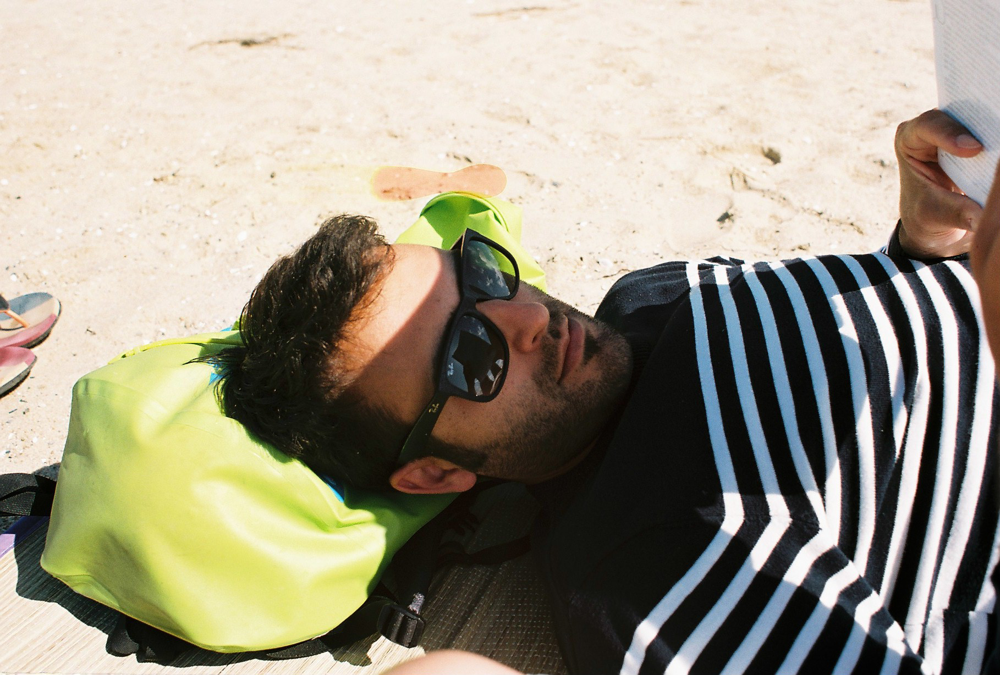
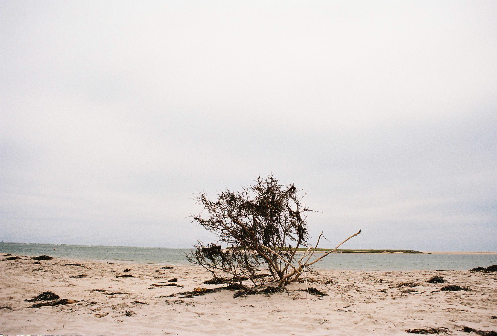
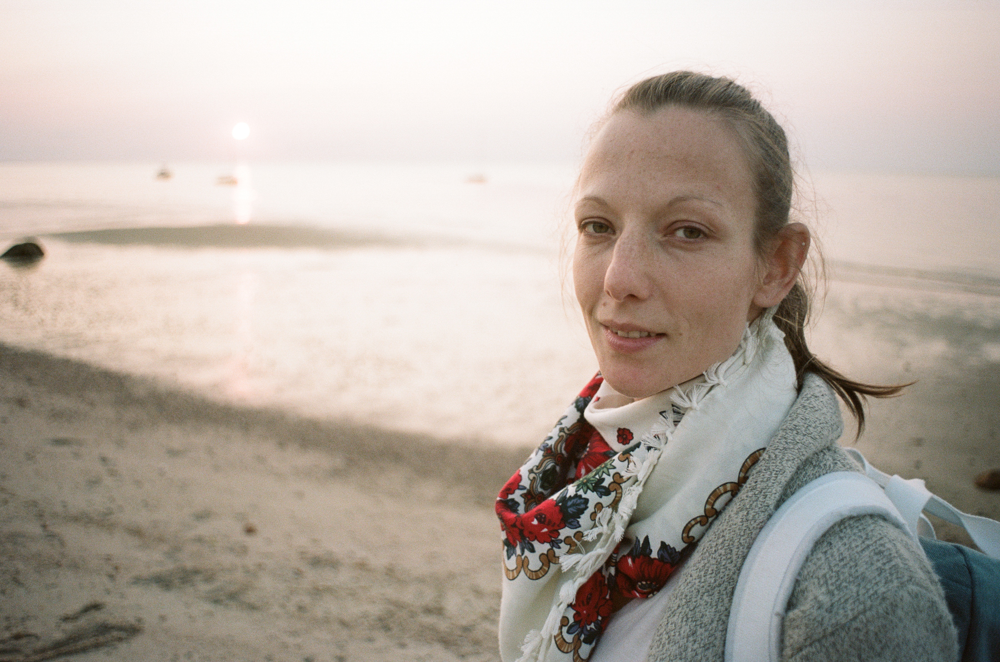

Here are some pictures taken during a week we spent visiting Cape Cod, early September. When I plan to spend more than a few days out of Montreal, I have to take a decision, a hard one, the kind of decision that will probably affect how I will spend these days: what kind of camera do I take? Film or digital? And what lens?  
For about a year, I use almost only the film one, a Nikon FM2. It's fairly lightweight, my favorite focal length is also super compact (a 28mm f/2.8) and using film usually pushes me to pay more attention and be more selective beforehand.  

I took the habit of processing my own films and to print my pictures in the darkroom. I only do B&W because color films are too complicated and require more equipment, especially to print. The problem is, on the seashore in September with a nice blue sky, it would be a shame to turn all these nice seasonal colors into greyscales! This is why I decided to buy some Kodak Portra 160 (super fine grain!) and go bankrupt by asking a photo lab to process them for me!   

In the end, it's costly (film processing + scan + 4"x3" print makes a total of about 0.80CAD per picture) but Borealis lab did a pretty good job at processing and printing! I was afraid I would not like using color films because I didn't really know what to expect. For a first try, I am very satisfied and I like the soft colors very much. They are neutral and provide a fair amount of details in areas where I would expect white or black, I must be too much used to digital :)

<iframe src="https://www.google.com/maps/embed?pb=!1m18!1m12!1m3!1d761456.5190993273!2d-70.86854045038693!3d41.79729113340096!2m3!1f0!2f0!3f0!3m2!1i1024!2i768!4f13.1!3m3!1m2!1s0x89fb15440149e94d%3A0x1f9c0efa001cb20b!2sCape%20Cod!5e0!3m2!1sen!2sfr!4v1612704499420!5m2!1sen!2sfr" width="600" height="450" frameborder="0" style="border:0;" allowfullscreen="" aria-hidden="false" tabindex="0"></iframe>  

[— @jonathanlurie](https://twitter.com/jonathanlurie)