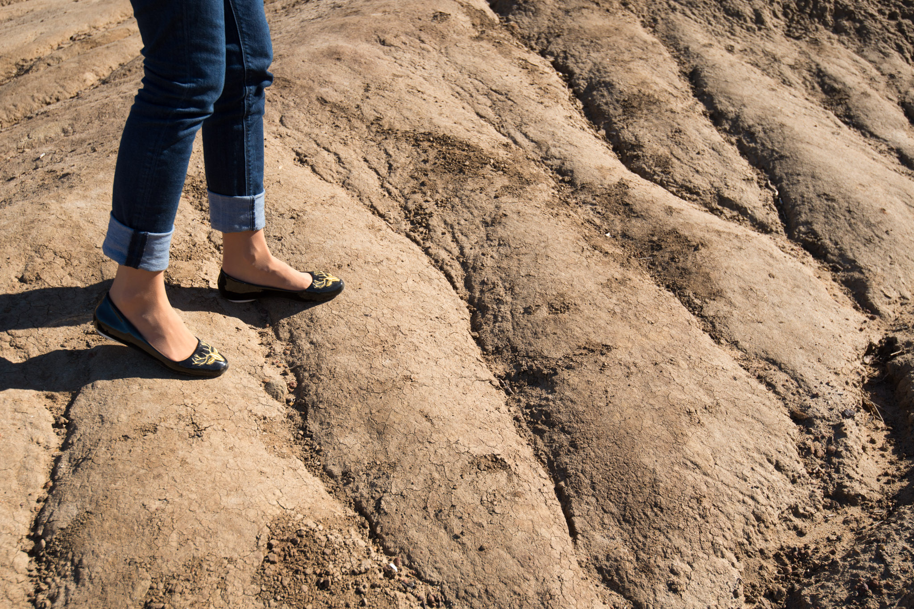
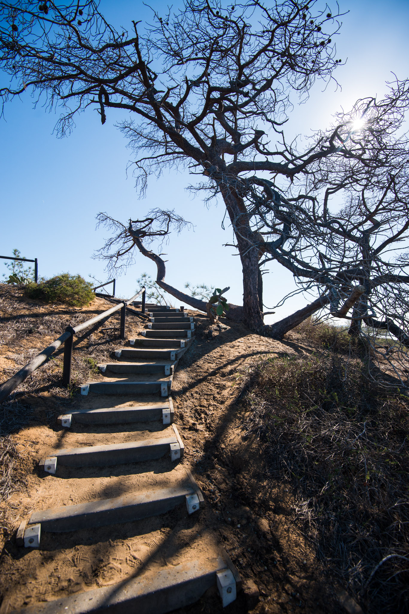

No matter if it's summer or winter, San Diego seems to always welcome you with a constant blue sky. Last December (2015), Patrycja was attending a meeting in biology in SD, the decision about "I may come with you" was not that hard to take!

Few hours after our connection in Chicago, we eventually land in South California, it's 9pm, 23°C/74°F, and we are experiencing a rather welcome jacket-to-tshirt transition from Montreal! Our first contact with the city is great, we drive along the bay by night, cross the downtown with the rental car and reach North Park to meet our AirBnb hosts and roommate for the next 11 days. Many thanks to Santi, Rodney and Bruno for being the best hosts in town! (and also for being our taco-advisors)

This series of photos is the first part of a short selection, in chronological order.

<iframe src="https://www.google.com/maps/embed?pb=!1m18!1m12!1m3!1d214579.15027386058!2d-117.24907030239697!3d32.82408441493177!2m3!1f0!2f0!3f0!3m2!1i1024!2i768!4f13.1!3m3!1m2!1s0x80d9530fad921e4b%3A0xd3a21fdfd15df79!2sSan%20Diego%2C%20CA%2C%20USA!5e0!3m2!1sen!2sch!4v1613228656373!5m2!1sen!2sch"  frameborder="0" style="border:0;" allowfullscreen="" aria-hidden="false" tabindex="0"></iframe>

Just at the north of the SD, La Jolla is a very attractive city, with a massive campus and a very decent shore. We've been there several time during our stay, to watch the birds, the seals or just walk along the ocean.

When Patrycja was attending the meeting (basically 9-5 during five days), I was wandering in the city and around with my camera. I took the next five pictures in Torrey Pines Natural Reserve, at 30/45 minutes from SD. If you just look at the park, it's very desertic, it's only about sand, cactuses and arid cracks. Since it's located along the ocean, it creates amazing contrasts, from blue to orange.

Point Loma is the peninsula that shapes San Diego Bay. At its north, we find Ocean Beach, at the south we find Cabrillo National Monument, and in the middle, the largest amount of graveyards I was given to see so far: Fort Rosecrans National Cemetery. Everybody knows there was WWI, WWII, Vietnam, Korea, Gulf 1 and 2, and everybody knows, with more or less precision, that thousands of soldiers perished during those events. What is less common is to be able to read the name of hundreds and hundreds of people who died on the field, or were somehow, involved in fighting under the American flag. I am usually not the patriotic kind of person, still, I was impressed and moved by this place.

Part 2 to come!
Cheers.

[— @jonathanlurie](https://twitter.com/jonathanlurie)