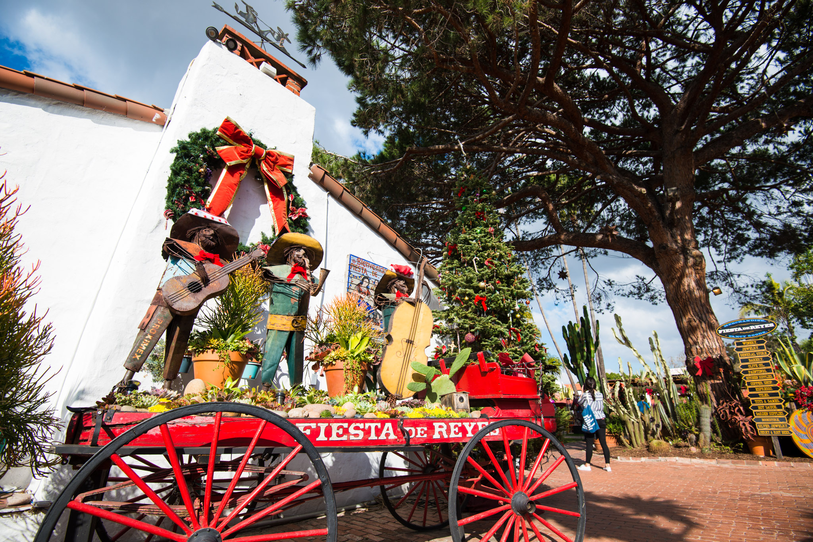
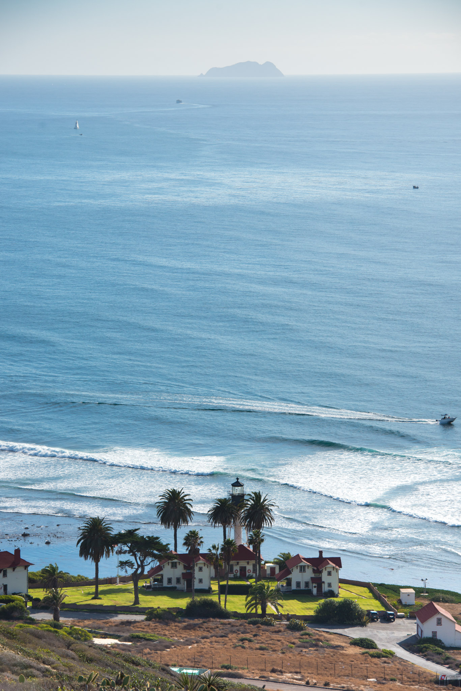

When Patrycja was done with the conferences, we could finally drive outside the city for longer than just the evening. On my side, I wanted to go back to Torrey Pines because there was still an entire half I didn't see and also it's a place worth sharing!

San Diego is one of the oldest city established in California, thus, it's not only about sea and desert, there is also the Old Town, well kind of. Actually, it's more a theme park now and it's even registered on the California State Park list. What better way to kill every bit of authenticity than tagging it "park"? Well, it's still a nice place to visit, Zorro and Sergeant Garcia were missing, though.

We didn't really know what to think about this Old Town, and actually nobody told us it would be amazing. On the contrary, every person we met who have been to San Diego before told us about Balboa Park. Huge, green, full of things to do, in the middle of the city. Here are how we can describe Balboa Park, a perfect place to stroll, eat an ice-cream and appreciate the diversity of the architecture (in a good way).

We could visit the city every single day and continue to discover nice places, still we wanted to see what's around and make the best out of the few days left here. We had the rental car, we said "Let's drive!" About 2h30 later we were in the middle of nowhere: Anza Borrego Desert State Park. Halfway between the Moon and Mars, we managed to find a trail with an oasis in the end!

<iframe src="https://www.google.com/maps/embed?pb=!1m14!1m12!1m3!1d56727.135210384025!2d-116.40102329800443!3d33.271405348111095!2m3!1f0!2f0!3f0!3m2!1i1024!2i768!4f13.1!5e1!3m2!1sen!2sfr!4v1472686621007" frameborder="0" allowfullscreen="" class="embed-content"></iframe>

For the very last day, we decided to go to Ocean Beach and walk on a pier so gigantic that they put a restaurant on it! The place is almost empty but it doesn't matter, Pati orders some tacos and I take a burger, but fun fact: a restaurant on a high pier actually moves a lot as the wave are crushing! Kind of disturbing, but not enough for our appetite. Then we headed south to see Cabrillo National Monument but also driven by our "what's further?" way of visiting places.

Cheers,

[— @jonathanlurie](https://twitter.com/jonathanlurie)