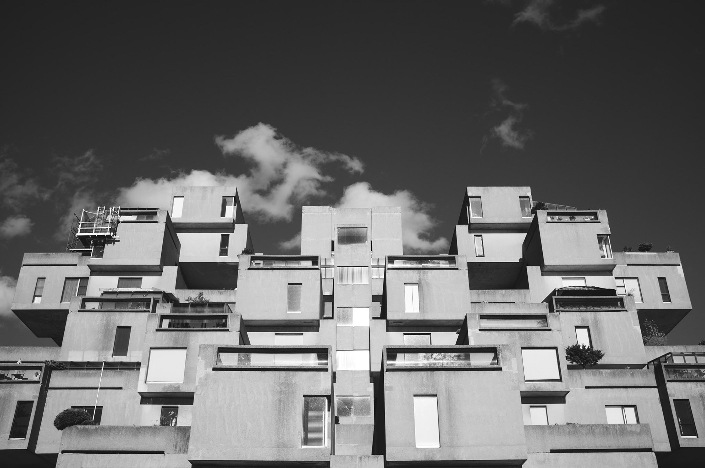

Here is a small subset of the places in Montréal I like to walk or cycle with no purpose, but always with my camera. For these pictures, I used my Fuji x100 and sometimes my Nikon D800.

[— @jonathanlurie](https://twitter.com/jonathanlurie)