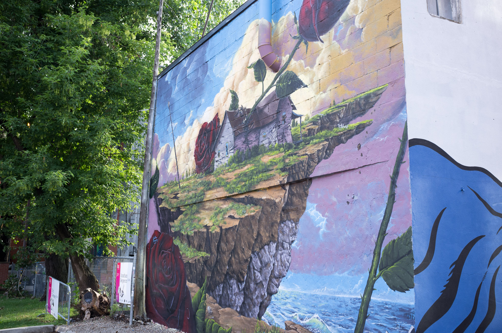
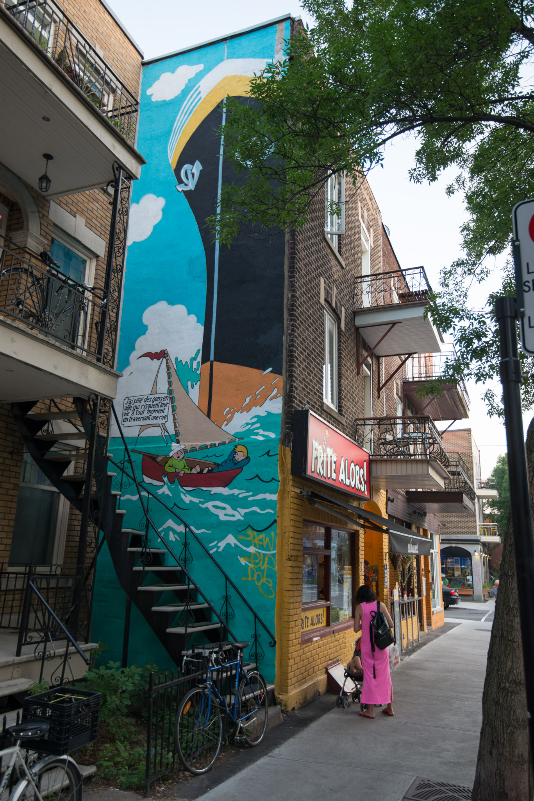

Street art, everywhere, gigantic murals, tiny decals, using a broad palette of colors and styles. The only thing I needed was my camera and some spare time. A series to be continued...

[— @jonathanlurie](https://twitter.com/jonathanlurie)