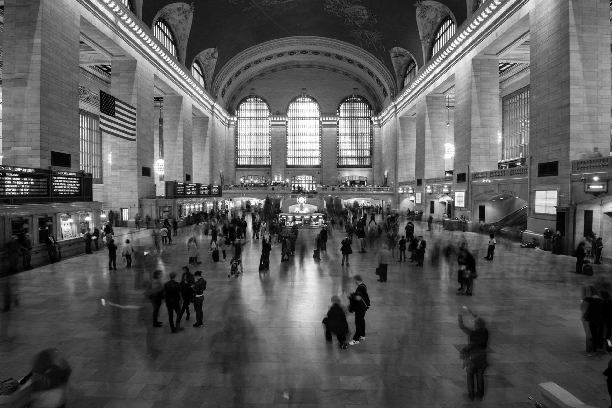

After many years of seeing bits of it in films and series, we finally found a few days to see the Big Apple with our own eyes earlier this month. During the first days, the weather was awful still, we walked and walked again under an unstoppable rain. We didn't care so much, we were in New York City.  
For this series, I wanted to have a high contrast, this is why I've chosen to edit in black and white, and with such weather, the colors would be washed anyway.

<iframe src="https://www.google.com/maps/embed?pb=!1m18!1m12!1m3!1d58436.303093951945!2d-74.0129100129685!3d40.764051608913114!2m3!1f0!2f0!3f0!3m2!1i1024!2i768!4f13.1!3m3!1m2!1s0x89c2588f046ee661%3A0xa0b3281fcecc08c!2sManhattan%2C%20New%20York%2C%20NY%2C%20USA!5e0!3m2!1sen!2sch!4v1612735286697!5m2!1sen!2sch" width="600" height="450" frameborder="0" style="border:0;" allowfullscreen="" aria-hidden="false" tabindex="0"></iframe>

Grand Central, I was told it's a "must see", and it is. I wanted to take a long exposure in such a place for a while to capture the movement of the crowd. On the picture below, the shutter speed is at 15 seconds while the ISO and aperture are the minimum possible. Hopefully, the dimmed light of the hall allows this kind of setting — I didn't have any ND filter on me this day.

Sometimes, you have to wait a bit, so that the guy with a funny bike gets trapped between you and this background you wanted:

When the rain eventually stopped, I seized my old analog camera (which is definitely not weather sealed) and shot about two rolls that I processed and printed by myself. But I keep that for another article!
Cheers.

[— @jonathanlurie](https://twitter.com/jonathanlurie)