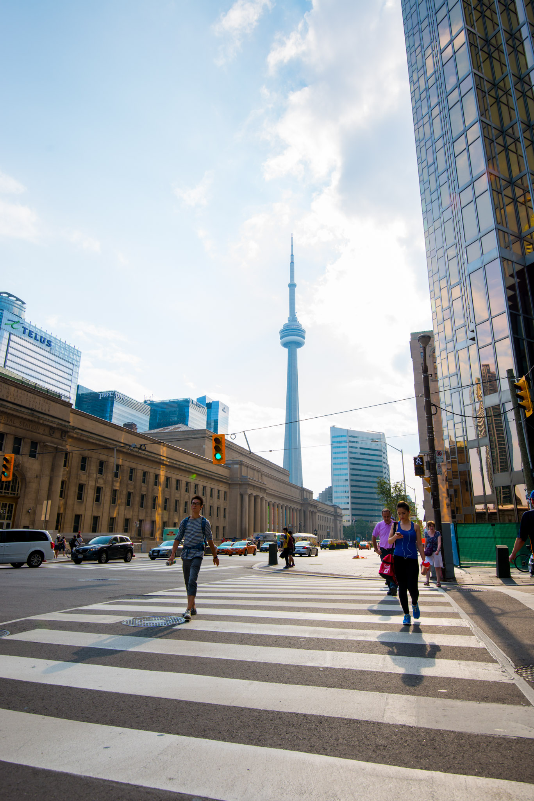
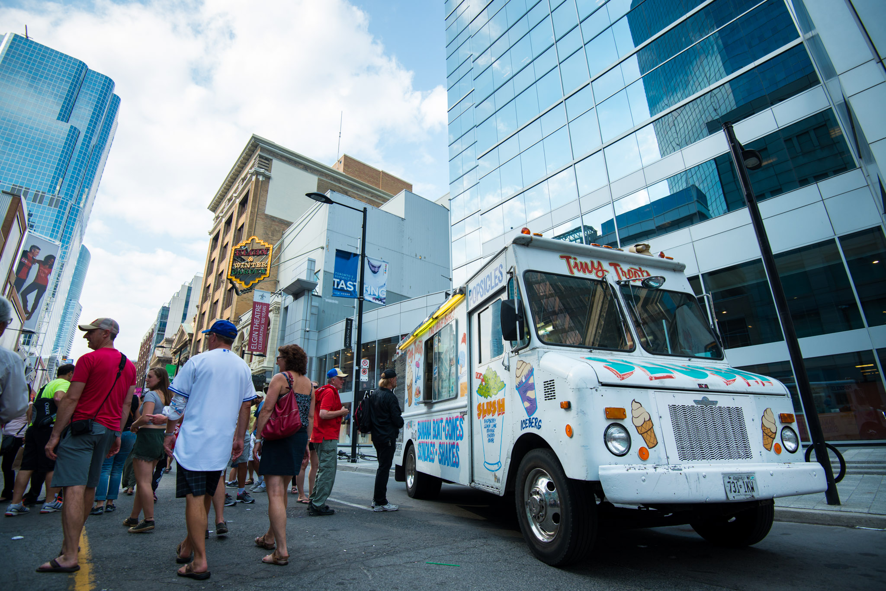

On late summer 2015, my wife and I spent six days in Toronto, Ontario, visiting, exploring, tasting, walking (a lot) and even swimming. The purpose was clearly not to relax, but surprisingly, we also found some hidden peaceful places. From the highest point panorama to dark dead-ends where street art springs, the largest city of Canada was jubilant all along.  
There is a legend saying roads in Québec are flawed and at the moment you cross the border to Ontario, they become slick and clean like curling rink. Well, according to our own experience of road 401 from Montréal to Toronto, Québec has no reason to be jealous!   
Leaving the 401 and taking Don Valley Parkway meant we were very close to Toronto, still the only thing we could see was the Don River and its surrounding parks.

<iframe src="https://www.google.com/maps/embed?pb=!1m18!1m12!1m3!1d184551.80842834423!2d-79.51814169631581!3d43.71840386133283!2m3!1f0!2f0!3f0!3m2!1i1024!2i768!4f13.1!3m3!1m2!1s0x89d4cb90d7c63ba5%3A0x323555502ab4c477!2sToronto%2C+ON%2C+Canada!5e0!3m2!1sen!2sfr!4v1470549045844" frameborder="0" allowfullscreen="" class="embed-content"></iframe>

After about 6h of driving, our first stop was at the hotel. Hopefully, it was in the eastern part of the city, on Pembroke St, close to Cabbagetown. We just took the time to check-in, drop our suitcases and figure out that our bedroom was at the basement level with no window. A good reason to get outside and start to discover right away.  

This working-class neighborhood is embellished with sex shops, cheap Indian hotels and thus, young travelers like us. We can’t call it a touristic place but since it’s very close to Yonge-Dundas Square (Toronto’s little Time Square) it’s the perfect starting point.

We spent the afternoon wandering, taking some landmarks and reaching the CN Tower to get our CityPasses for the next days. We could quickly see the top of the financial district buildings, but as close as we were, we couldn’t reach the glass towers without crossing the crowd of Yonge-Dundas Square! Jugglers, fire-eaters, dancers and all kind of street performers were there, all surrounded by a dense crowd. We had the impression the entire city was concentrated in the square! Is it like that every day? Hopefully not. We quickly understood it was the last day of BuskerFest, that happens every year during the last days of august.

I don’t really know if we can judge the size of a city by its financial district, but after having crossed successively Queen Street, Richmond, Adelaide and King Street, we knew Toronto was way bigger than Montreal. It was very dense and crowded, but it was not suffocating. The streets are wide – like “north-American wide” – and a constant breeze reminded us the proximity to the lake. At the corner of Yonge and Front St, we can finally see the emblem of Toronto: the CN Tower. It’s one of the main attractions of the city, unfortunately almost eclipsing all the others. We had more security checks to enter the tower than to take-off from Paris. Ok guys, we just wanted to pick our CityPasses.

Along the lake, Queens Quay West seems to be more for Torontonians: joggers, young couples with trolleys and dog walkers. Just at the corner, we decided to spend a bit of time at the beach, because yes, there is one, with sand, deckchairs, and parasols. It almost looked like we could take a bath, but it was actually more about boats crossing to Toronto Islands.   
The sun was exactly like a late summer afternoon: warm and orange. Relaxing at the beach far from the swarm of the city is exactly what we needed after the few hours we spent on the road. We could have stayed for hours… But no. We are attracted by big cities, we love them, and we can’t remain static and idle while we could walk and discover. The next destination was Chinatown by Spadina Avenue.

Hearing that name: “Chinatown”, has always aroused a curiosity I never had the opportunity to feed. I knew it was not about dragon costumes at every corner, at least not on a daily basis, but once there, all the fruit shops, cheap cloth and restaurant at every corner seemed like traveling further than just the next district. With a fragile balance between the neons and the setting sun, the whole scene looked very photogenic.

After having walked about 15 km (and drove 6h), it was time to go back to the hotel, experiment some slow shutter-speed photo on the way, and to try to be fresh for the next entire day of urban discovery.

Note: This evening, I had my very first fortune cookie. “July” on a side, “Happiness is activity” on the other.

# Behind the lens
It is not always easy to know what gear to take for a city tour: a long lens for capturing far glass tower details and reflections? A wide angle for the vertigo effect due to the high buildings proximity? Or maybe a classic prime 35mm for some street photography? And this is only the artistic approach. 
As a normally proportioned human being, I have to think also about the weight I will carry including photo gear and the rest – a bottle of water, some snacks and usually a sweater or a light jacket, not to mention what does not fit into my wife’s tiny purse.

We always face this alternative: carrying all the gear we might need OR taking only one or two lenses and work with this artistic constraint. Without any doubt, I choose to carry less and walk longer. With my Nikon D800, I have to choose my lens carefully because I won’t be able to take all of them. My weapons of choice are a 16-35mm f/4 and a classic 70-200mm f/2.8. Over the hikes, travels and days of carrying this combo, I find it very versatile and I never felt limited. In addition to the weight issue, if you choose to take all your lenses, I am afraid you will spend more time switching lenses than taking photos.

When I want to go even lighter, like for these first hours in Toronto, I take only the 16-35mm f/4 for its very playful range. Though, I don’t overdose using a very large angle as it can get boring for a whole series. On the other side, at 35mm, I can shoot more classic street scenes where people have the first role, and since it’s less extravagant, I’ll never get tired of it. Versatility is the key.

[— @jonathanlurie](https://twitter.com/jonathanlurie)