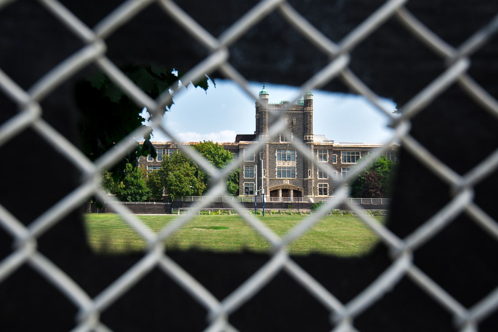
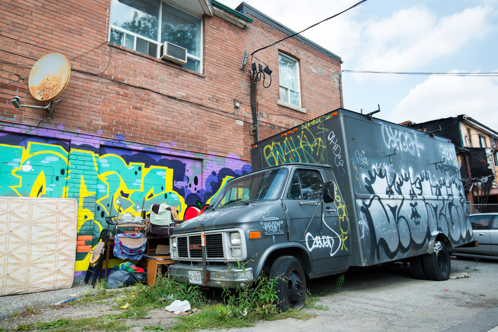

CityPass in hand, our first target was the Royal Ontario Museum (ROM). We headed north for the first time, starting by Allan Gardens and its homeless community, following with Carlton Street where cheap shops are more and more scattered to leave room to fancy boutiques, then Queens Park Crescent with the Ontario Legislative Building, and finally we reached Bloor St with luxury jewelers and haute couture stores. Within a range of only 2.5 kilometers, we faced two opposite worlds that only share a small bit of middle-class buffer as a neighbor. I find this pattern sadly recurrent in western cities and Toronto is no exception.

<iframe src="https://www.google.com/maps/embed?pb=!1m18!1m12!1m3!1d2886.0605903102287!2d-79.39696578410917!3d43.667709679120925!2m3!1f0!2f0!3f0!3m2!1i1024!2i768!4f13.1!3m3!1m2!1s0x882b34baf3dae513%3A0xc98434e11ec5f592!2sRoyal+Ontario+Museum!5e0!3m2!1sen!2sfr!4v1470703960202" frameborder="0" allowfullscreen="" class="embed-content"></iframe>

From the outside, ROM and its sharp-edged glass walls definitely look like a modern museum, however, a step inside was enough to jump back in old civilizations’ time. Thanks to cultural items, weapons, and jewelry, we could easily discern the technological advance of the Chinese over Europe 3000 years ago. On the contrary, the exhibition about First Nations showed they were still wearing animal skins and crafting knives out of bone 200 years ago. In my opinion, this part was bit offending because it didn’t even show the richness of their culture through their beliefs and myths. As a matter of fact, this contrast was enhanced by the adjacent exhibitions about other technically advanced civilizations like Japanese and Korean.

At 1 pm we traded the freezing cold museum for a warm and sunny walk along Bloor Street and Bathurst Street, heading south. It’s generally far less crowded than Spadina and has gorgeous murals – Bathurst rules Spadina in term of street art! Both leads to the lake, and approximately to our next stop: the CN Tower.

CN comes from Canadian National, the railway company that built the tower for communication purpose in 1976. Since then, millions of visitors climbed up to the public area, standing at 342 m. I thought we could enjoy the sunset from up there and take some photos of the city with both natural and artificial light. When the sun got low, the pollution was so dense that it disappeared far before reaching the ground surface, I didn’t expect that! It ruined a set I absolutely wanted to take: when the far skyscrapers from Mississauga and Humber Bay would draw long shadows on the lake.

At night time, we were still at the top when the Blue Jays started to play in the Roger Center. The angle was not easy because the stadium is really at the foot of the tower, but after few tries, I managed to obtain the “crowd sensation” I wanted.

# Behind the lens
Museums are not the best place for photo composition. They are all arranged the same way and use a lot of glass to protect the items. In addition, during the weekend, you will certainly end up with a lot of folks on your photos. In such situation, you have two choices: you embrace the crowd and include it into your composition or you reject it and focus on the art piece. 

On the first hand, you could try to catch the atmosphere and people’s reaction towards the exhibition. In this case, the piece of art is not the center of the photo. Going even further, we could easily imagine a composition showing only people’s reaction towards a painting – for example, the permanent crowd around Da Vinci’s Joconde. On the other hand, you could pick a detail of a sculpture, possibly with a short depth of field to lower the disturbance from the background and ensure a proper reading of the photo. With bigger pieces, it’s important to add a sense of scale. It usually gives a stronger effect to include a person, even if he/she does not interact directly with the art piece.

At the evening, taking pictures from the CN Tower was not easy. I had great expectations: purple sky, long shadows of distant buildings, millions of lights from the financial district, 360° panorama and wide angle vertigo deepness! 

There are actually two floors we can visit but none makes it easy to take great night shots. Do I prefer triple glass windows with a massive reflection of indoor lights, or thin white painted metallic mesh? I still don’t know which one is worst. 

If you find yourself in such a situation, a polarizing filter is mandatory to reduce glass reflection. Unfortunately, it won’t be enough. The trick is to press the lens hood against the glass and cover the light holes with your hands or to wrap a scarf around your lens and press the cloth against the window. Obviously, the best would be to switch off all the indoor lights but this is rarely an option. 

From the top, everything is far. My 70-200mm was essential to peak details: a rooftop swimming pool, planes, a baseball player, but also to profit from the stacking effect of long focal length. Combined to a deep field of view with few obstacle, Mississauga doesn’t look so far from Humber Bay! 

On the contrary, a wider angle will reveal the volumes by exaggerating the proportions of what is closer. I used my 16-35mm at 24mm to capture the financial district and show its density. Thanks to this angle and a high point of view, I could target lower than the horizon line and include the nearest part of the city as well as the furthest. Thus, we can observe the architectural contrast between the financial district, which starts directly at the foot of the Tower, and the rest of the city, featuring much smaller buildings. In the context of architectural composition, when I can’t use a perfect symmetry, I’ll try to stick to a classic rule of third. In this shot, I used the highest building (the white BMO tower) to make it work.

[— @jonathanlurie](https://twitter.com/jonathanlurie)