When we decide to visit a city, we usually don’t take public transportations because it gives us the impression we could miss something. Murals, hidden street art little pieces, independent shops, nice terraces, you don’t see them from the bus! During the first two days, we walked more than 35 kilometers, and we liked it! Again, this day was a walking day, in the direction to Casa Loma, the most megalomaniac place in town! 
To get there, we walked along the LGBT neighborhood (aka. The Village) and the colorful victorian houses it displays along Church St.

<iframe src="https://www.google.com/maps/embed?pb=!1m18!1m12!1m3!1d5772.504978712334!2d-79.38498992132405!3d43.66371841648377!2m3!1f0!2f0!3f0!3m2!1i1024!2i768!4f13.1!3m3!1m2!1s0x882b34b352363bf3%3A0x1f639634d3e1912a!2sChurch+and+Wellesley%2C+Toronto%2C+ON%2C+Canada!5e0!3m2!1sen!2sfr!4v1470705023017" frameborder="0" allowfullscreen="" class="embed-content"></iframe>

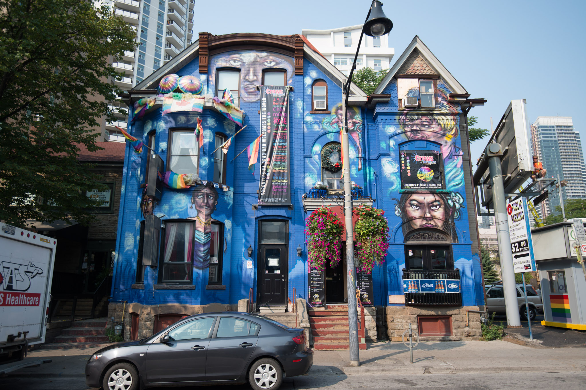
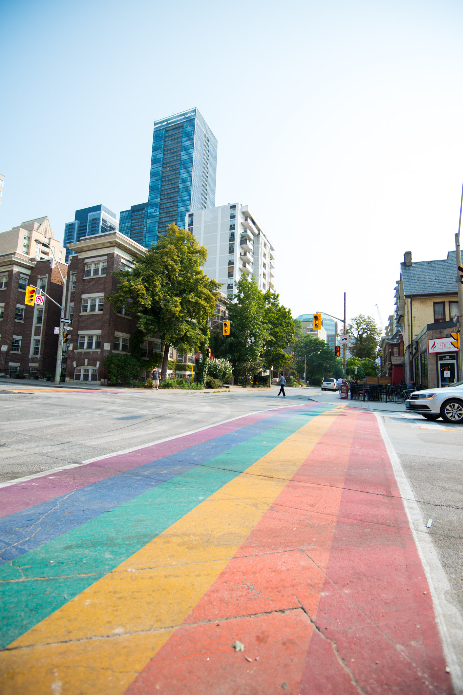
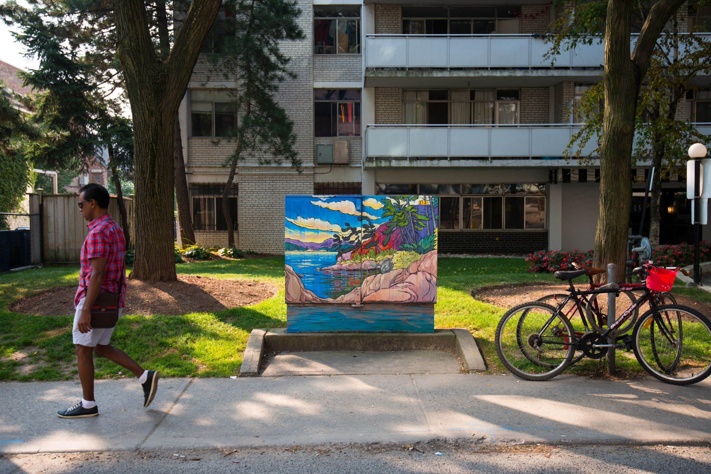
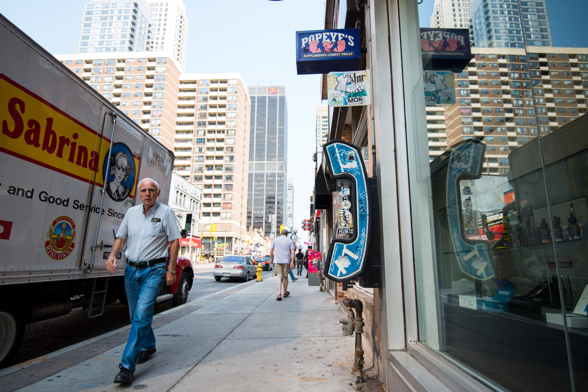
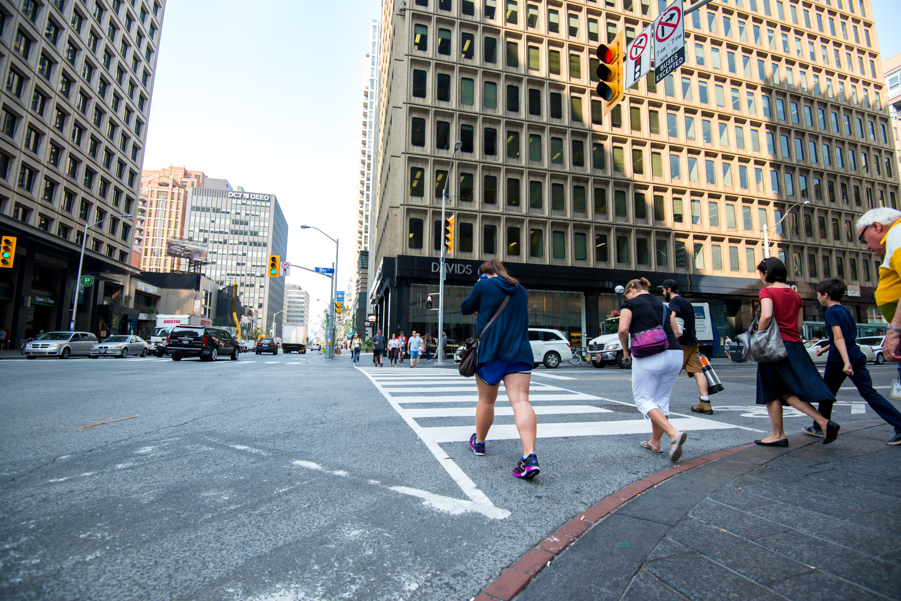

Lowther Av marked the entrance in a new neighborhood: the Annex. To put it simply, we don’t fit anymore. No more paintings, no more working class, the quiet streets of the Annex are all about Edwardian style Mansions and houses from late 19th century. It’s always been a place of choice for businessmen and notable people of Toronto and it’s supposed to be still very active. However, we met more Porsche Cayenne than people there, which was a proper introduction to our next visit.  

Casa Loma sits on the hill at the very end of Spadina Av. We climbed the Baldwins Steps, walked on the edge of a low wall to catch the view, and looked south to the lake. It certainly looked very different in 1911, when Sir Henry Pellatt chose this spot to offer his wife a mansion, but the view is still catching! We went there without reading anything about Casa Loma. We didn’t know what to expect, why it was built or even by whom. Hence, our first reaction while finally standing in front of it was “What is this architectural craziness?”. I am no expert in this art but it intrigues me enough to do my own research and it appears that Casa Loma is described as “Gothic Revival”. It would hardly fit in another category.  

At the entrance, the staff suggested watching a short introductory film in the former indoor swimming pool. We didn’t really fancy the idea, but we couldn’t remain ignorant any longer. It ended up to be very informative about Pellatt’s life, but – spoiler alert – sad at the same time. To make it short, Pellatt was an accomplished businessman: he build an industrial empire, was involved in politics and had a lot of friends, thus, he wanted a luxury place for mundane parties. Ninety-five people could have stayed overnight and all of them would have had their private bedroom, with hot water and electricity – which was unbelievable at the time. They could play organ while wine-tasting the best bottles from Henry’s private cellar. The means were huge though the project was bigger. Pellatt got unlucky in both politics and business and his empire collapsed. Casa Loma was never finished and soon abandoned during years before becoming part of new projects.

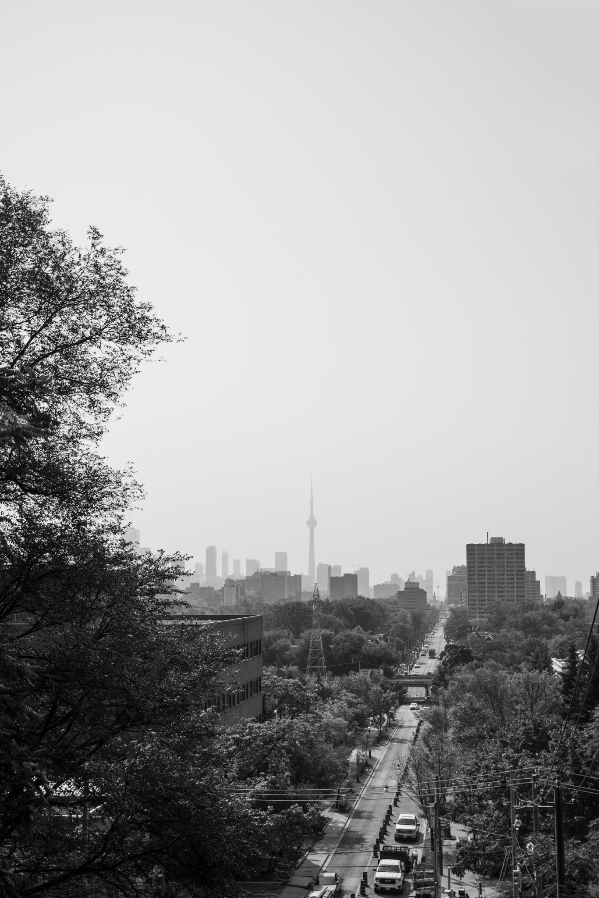
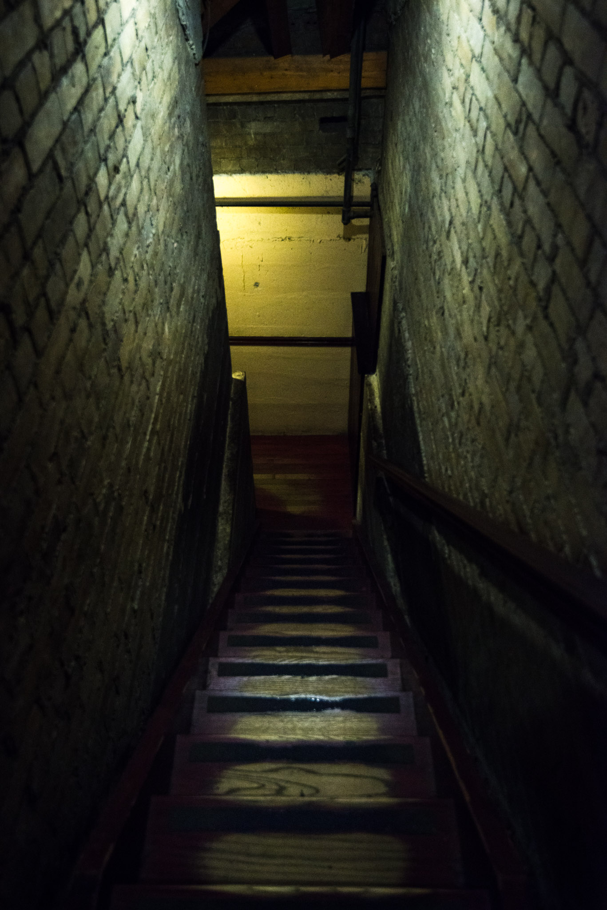
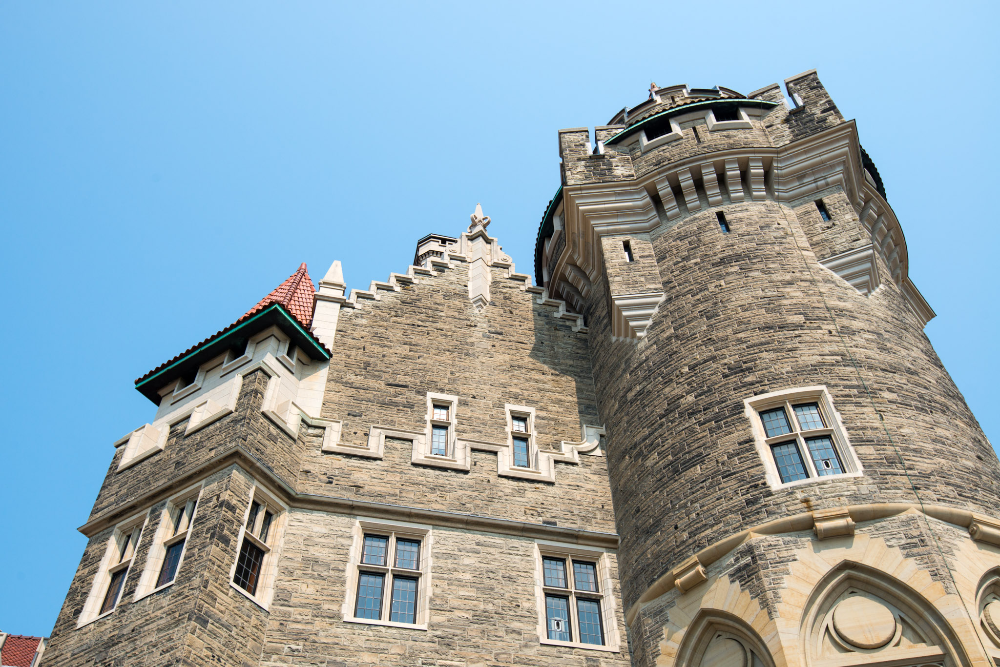
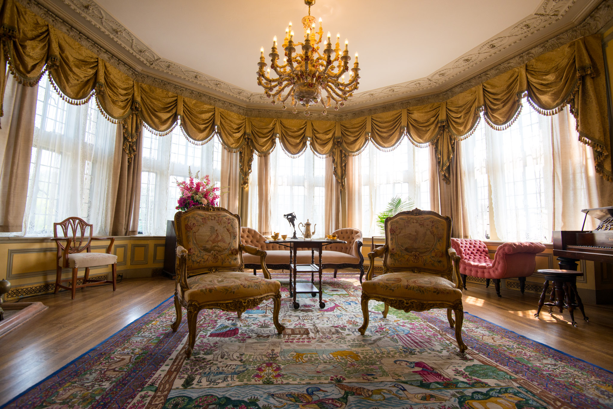
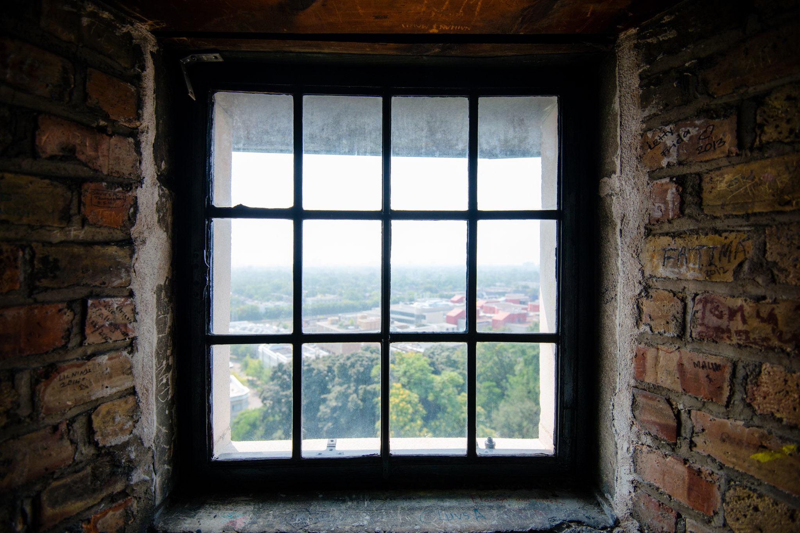
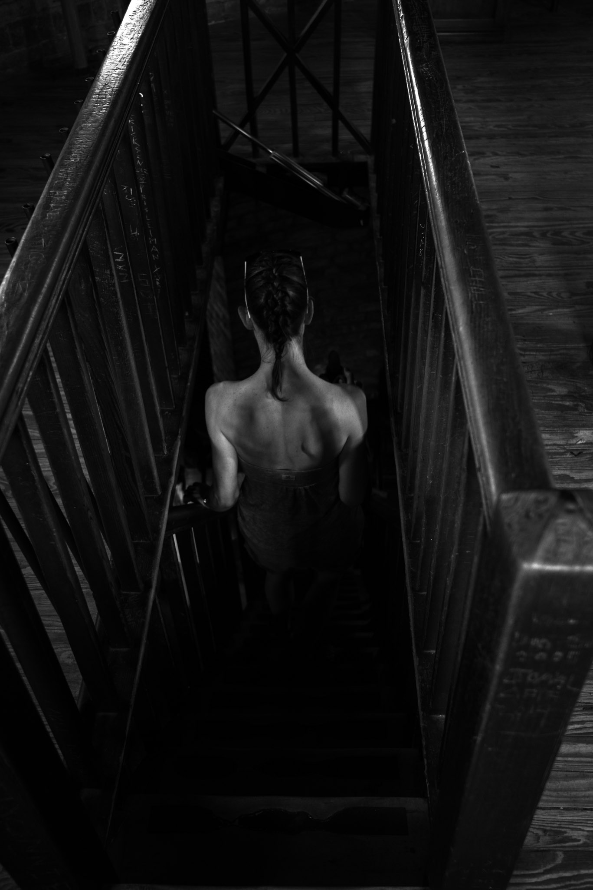
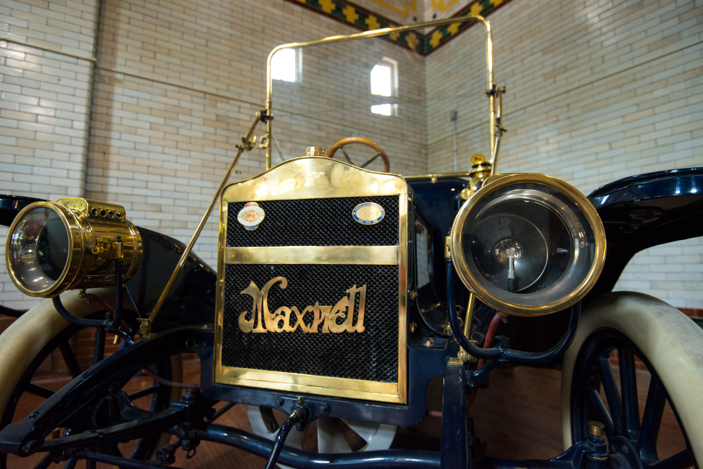

After having walked to each and every tower, bedroom, hall and attic corner, we decided to do an infringement to our golden rule: we would take the subway to go back to town.  

Earlier this day, I’ve spotted on the map a neighborhood mysteriously named “The Beach”. Was it an actual beach, where we could take a bath and lay down on the sand? We hopped in the car, headed east and decided to find out! 
Twenty minutes later, we were walking barefoot on the sand. Ok, it’s not super thin Hawaiian sand, but the spot is calm, charming and swimmable, which is priceless considering the proximity to downtown Toronto. Always check the map, that’s another rule. (taken with my smartphone)

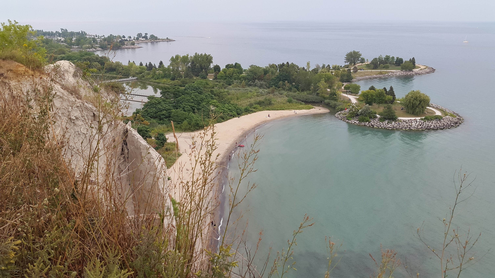

We came back at the evening, eager to eat something a bit heartier than our last salads. What started like a quick dinner quest turned into a rather long night expedition by the City Hall. In addition of being the official logo of the city, the Hall is an amazing piece of architecture. Just in front of it, we sat on the edge of Nathan Phillips Square’s fountain and stared at the huge TORONTO neon letters changing colors. It appears to be a casual place to hang out, even at night! 

On the way back to the hotel, we finally found what we were looking for: a generous shawarma and some falafels from a Lebanese fast food at the corner between Yonge and College. Not the worst way to end a 15 km walking day!

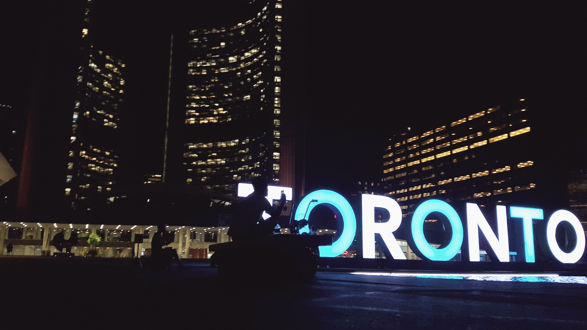

# Behind the lens : Casa Loma
I wouldn’t say Casa Loma is the best place for photographers. Like almost any house-museum, you cannot touch anything and everything looks a bit fake and too well laid out. The fact it was residential makes it even more extravagant and entirely worth the visit, but as a photographer, I had to find a hook.  

During the short film, it was said they were never really done with the renovation, even now, as a museum. This point stroke me when we took the stairs to the attic or to the wine cellar: bankruptcy led to an unfinished house.
This was my hook, the contrast between what Henry’s friends would see: fancy salons, organ or embroidered velvet curtains, with what we can see behind the scene: raw walls, dusty staircases, visible plaster, etc. When I took the photos, it was clear I wanted to show both sides of Casa Loma: the rising and the fall.  

Even though Casa Loma is huge, it does not leave enough space for a long focal lens. I found very comfortable using my 16-35mm but this time, I rather used the second part of the spectrum: 24-35mm.

# Behind the lens : night in Toronto
For our night expedition to the downtown, I chose to take my Samsung Galaxy Alpha as a camera. I wouldn’t call it a success because it would have been way easier with my DSLR, but I was pleased to see I can take night pictures with a phone. To me, the limitation lies in the software because the default response to low light is to boost ISO, which is a shame. Being able to perform long or even semi-long exposure (up to 2 sec) at low ISO would definitely add value to the device. That said, I would not recommend using this kind of device for a deep-night session like for chasing the Milky Way or a circumpolar. Smartphone sensors are still too little to absorb the electronic noise of a long exposure but in the city, we are not exactly in this configuration. We have neons, spots, car lights and square feet of glass to play with reflection and wake those little sensors up!  

Just a point about AF (autofocus). Since most of the picture will be dark, the AF may jam, exactly like would a do DSLR if the focus area targets a dark spot. The advantage for the smartphone, you can tap anywhere on the screen and it will focus. Select a lighted spot which is as far as your subject and you’re done.

[— @jonathanlurie](https://twitter.com/jonathanlurie)