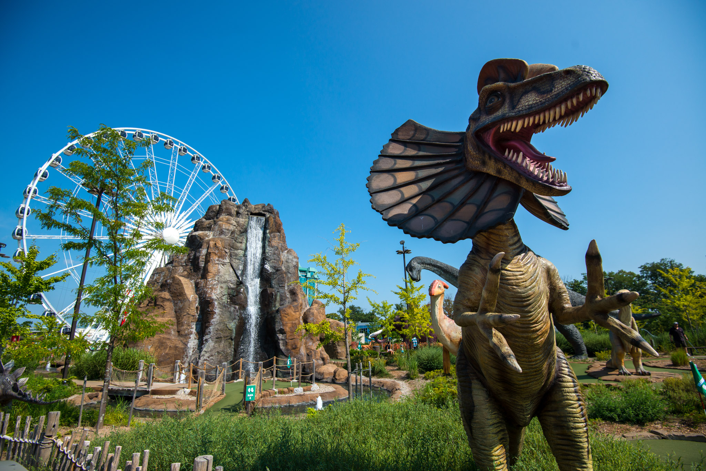
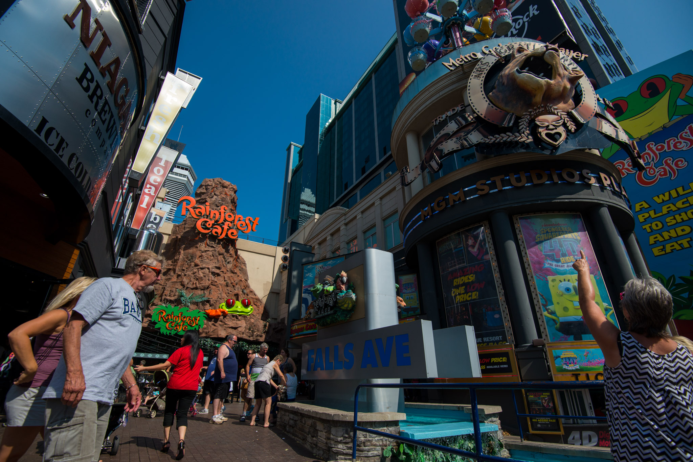
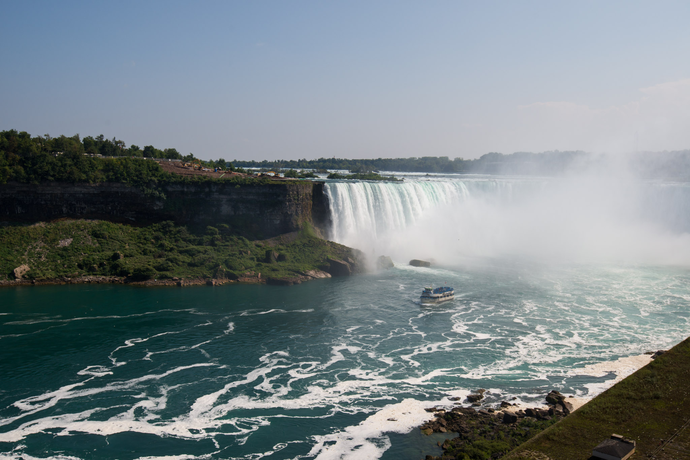
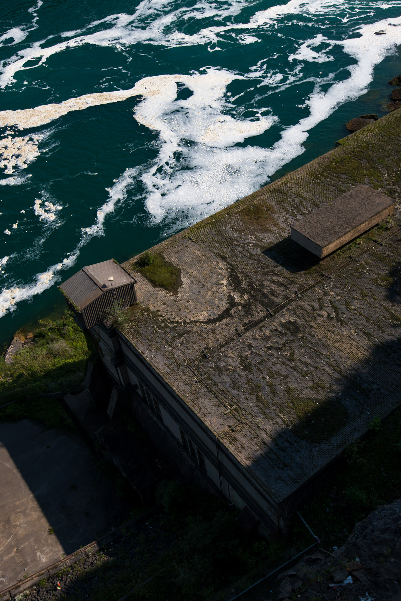
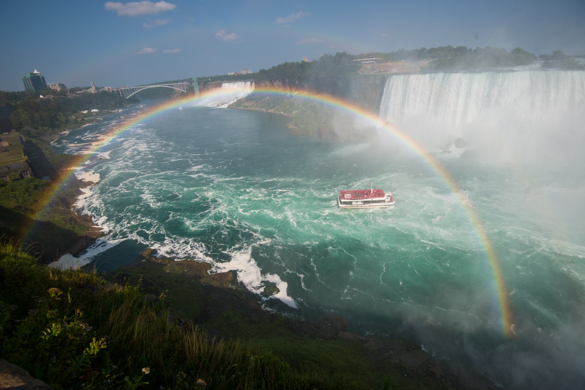
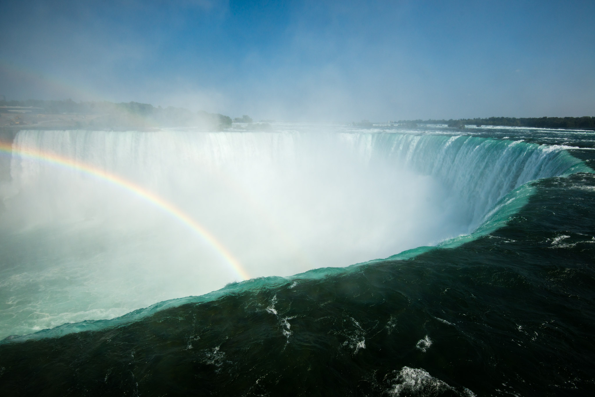
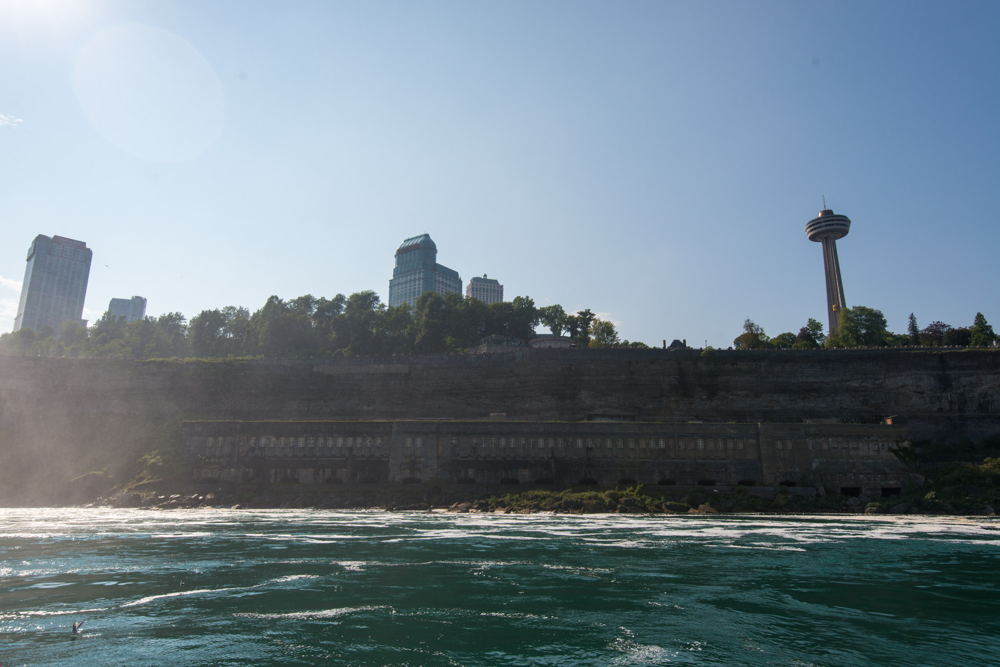
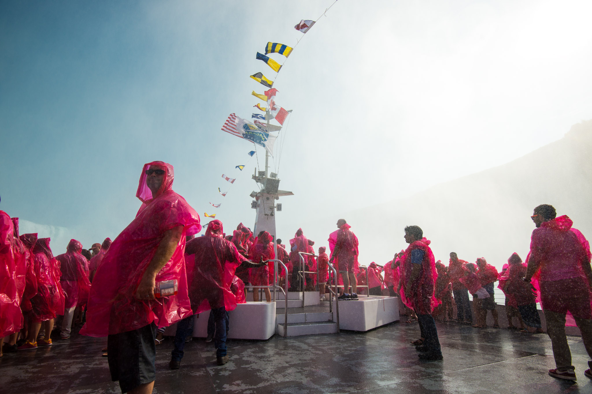
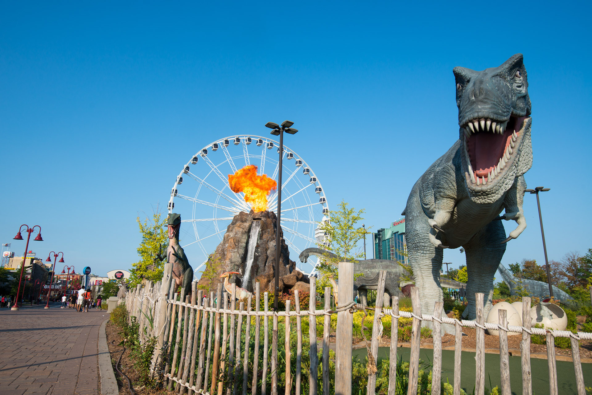

We spent our last day in the Golden Horseshoe at Niagara Falls. A classic would say some, a nightmare for others. The rare picture I had of the Falls was Superman rescuing a boy from falling, in the second opus of this 80s’ marvel. It hasn’t changed so much since then, except no one fell. The less known part of the Falls, what is around, is also the most strange and unexpected. Dinosaurs. I tried to understand the relation with the reason we were here, but then a friend of mine told me *"You don’t need any reason to bring dinosaurs!"* – legit. In case people would get bored of dinos, we also found darks rides, horror movie theaters, arcade games and of course, tons of fast food restaurants. All the craziness European people could imagine about America was there and we were still on the Canadian side!

<iframe src="https://www.google.com/maps/embed?pb=!1m18!1m12!1m3!1d93292.82668441358!2d-79.15807410212244!3d43.054036582701094!2m3!1f0!2f0!3f0!3m2!1i1024!2i768!4f13.1!3m3!1m2!1s0x89d3445eec824db9%3A0x46d2c56156bda288!2sNiagara%20Falls%2C%20ON%2C%20Canada!5e0!3m2!1sen!2sch!4v1613250581047!5m2!1sen!2sch" width="600" height="450" frameborder="0" style="border:0;" allowfullscreen="" aria-hidden="false" tabindex="0"></iframe>

In my opinion, it’s barely worth to go there but not taking the biggest shower of your life. So we book a boat ride for about $16 – long raincoat included – and embarked. The 30-minute ride started placidly, but the noise was growing. At the closest point from the Horseshoe fall, the biggest one, we were really thankful for the raincoat! The shower was so intense we hardly managed to keep our eyes open, no matter, we barely could see. When the boat was on its way back, everyone was wearing this a smile, except those who put this coat a bit too late! I think my wife wanted to do it more than I would, but in the end, I have to admit it was such a pleasure we decided to keep the coats as souvenirs!

# Behind the lens
What I found cool about the waterfall is actually how people behave. For most, us included, it was a very uncommon situation. It’s so huge and powerful you can only feel humble and tiny. Everybody seemed to come back to the first time they saw snow.  

The ability to take photos under a strong rain or at the feet of a waterfall will depend on the gear you are using. With a high-end DSLR and a professional lens, you can almost go out without worrying. Those pieces are weather sealed and made to endure harsh conditions. This explains the price tag compared to a prosumer camera – still, it’s not waterproof. In a case of doubt, a rain sleeve will do a good job. There are two kinds of them: one-time use and pro. The one-time version is usually transparent and looks roughly like a plastic bags in a shape of a camera. The pro sleeves are made of water resistant black fabric with a transparent window at the back, an easy access for the right hand, and most of the time, a tripod "hatch". Since I am more a “less is more” kind of person, I would definitely choose the one-time use kind because it’s lightweight, very compact and will technically last longer than what its name suggests. 
I reckoned my D800 and the 16-35mm lens would be fine under such a shower and I just wanted to protect them for when I stopped using them. I simply made the collar of my fancy raincoat larger so that I could easily shelter my camera under the poncho.  

There was still a problem: drops on the front lens. Attaching the lens hood helps a bit and prevent most of the drops from reaching the front lens, unfortunately, wide angle lenses usually come with pretty short hoods. The best would be a to use a dry piece of shower towel with a strong sponge effect.
When done, think about drying your camera with an absorbing tissue before removing the lens. Every corner must be dry, especially where electronics is hiding. If you were using a UV filter, unscrew it because there might be water trapped behind. When it looks dry on the outside, detach the lens and clean the mount – but don’t clean inside with the same tissue. To be sure you removed all the humidity, you can put the camera in a box with uncooked rice for a while. Unlike us, electronic devices don't like to feel warm after a shower, simply avoid radiators.

[— @jonathanlurie](https://twitter.com/jonathanlurie)